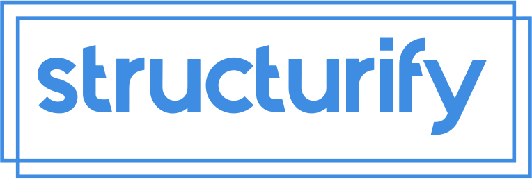

  

  <strong>Developer-centric headless API platform on a modern stack</strong>

  A headless, GraphQL devtool platform delivering ultra-fast, new platform starter. Start your car, pet or environmental dev api quickly.

 

  Join community:  
   <a href="https://github.com/structurify/structurify/discussions">GitHub Discussions</a>
   | 
  <a href="https://discord.gg/XXY97KXdG8">Discord</a>

 

  

## Table of Contents

- [Description](#description)
- [ALPHA Roadmap](#alpha-roadmap)
- [Contributing](#contributing)
- [License](#license)

## Description

Structurify is an open-source devtool platform that serves a starter of your future developer api platform. It's designed to serve any of your ideas for future devtools that would alow us as a community to quickly build awesome stuff.

## ALPHA Roadmap

- [x] Data Lake - Bronze tier
- [x] Search Engine
- [ ] DLQ
- [x] Mailing
- [ ] i18n
  - [ ] Errors
  - [x] Mailing
- [x] Open Telemetry
- [x] Event Emitter
- [ ] Permissions
- [ ] GraphQL API
  - [ ] auth
  - [x] organization
  - [x] project
  - [x] invite
  - [x] member
  - [ ] webhooks
  - [ ] api keys
- [ ] Tests
- [ ] Unit
- [ ] Integration

## Contributing

I would love your contributions to create best tool for a platform starter

## License

Disclaimer: Everything you see here is open and free to use as long as you comply with the [license](https://github.com/structurify/structurify/blob/main/LICENSE). I promise to do my best to fix bugs and improve the code.

#### Crafted with ❤️ by Marcin Mrotek

kontakt@marcinmrotek.pl
